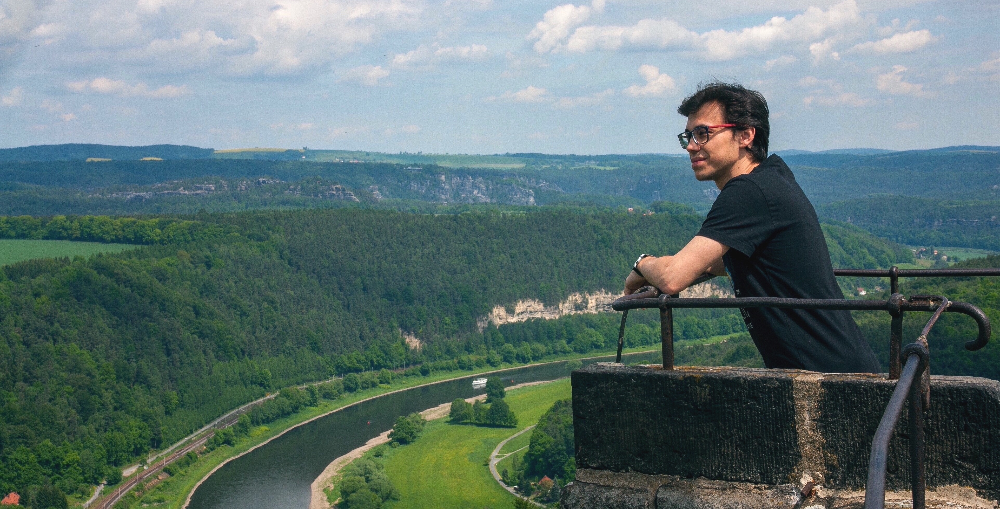

Hi, I am Nikita!

I am a PhD student at [Humboldt University of Berlin](https://www.wiwi.hu-berlin.de/en/professuren/quantitativ/wi/standardseite-en?set_language=en) and research associate at the [Monedo](https://www.monedo.com) data science team.

---

I am passionate about machine learning and data science. My latest work focuses on machine learning applications in the field of credit risk analytics. I also enjoy participating at machine learning competitions and hackathons.

This website hosts my blog with machine learning tutorials, competition solutions and findings from different projects. It also provides links to my academic publications and developed software packages.

---

If you want to chat or see more of my work, please feel free to connect with me on different platforms:

<ul>
  <li><a href="https://www.linkedin.com/in/kozodoi">LinkedIn</a></li>
  <li><a href="https://github.com/kozodoi">GitHub</a></li>
  <li><a href="https://scholar.google.com/citations?user=58tMuD0AAAAJ&amp;hl=en">Google Scholar</a></li>
  <li><a href="https://www.researchgate.net/profile/Nikita_Kozodoi">ResearchGate</a></li>
  <li><a href="https://www.kaggle.com/kozodoi">Kaggle</a></li>
</ul>

---

I am also happy to chat on other social media:

<ul>
  <li><a href="https://twitter.com/n_kozodoi">Twitter</a></li>
  <li><a href="https://www.instagram.com/n_kozodoi/">Instagram</a></li>
</ul>
