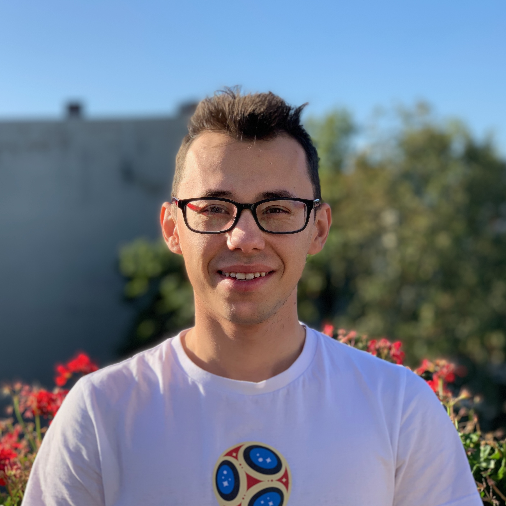

Hi, I am Nikita. I am a PhD student at Humboldt University of Berlin and research associate at Monedo. 

I am passionate about machine learning and data science. My latest work focuses on machine learning applications in the field of credit risk analytics. I also enjoy participating at machine learning competitions and hackathons.

This website hosts my blog with machine learning tutorials, competition solutions and findings from different projects. It also provides links to my publications and software packages.

If you want to chat, please connect with me on social media.