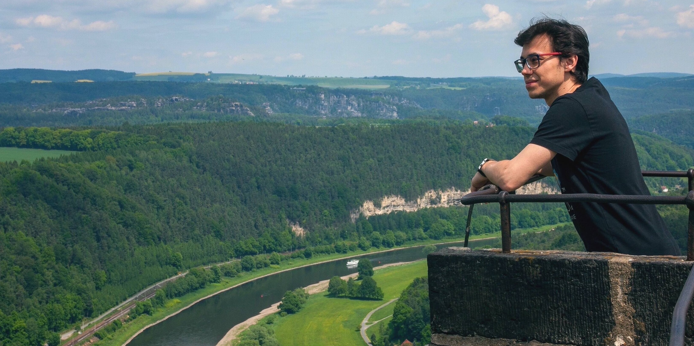

<link rel="stylesheet" href="path/to/font-awesome/css/font-awesome.min.css">

<link href="https://emoji-css.afeld.me/emoji.css" rel="stylesheet">

  

    
  
  
  

    <h1>Hi, I am Nikita!</h1>
    
Click <a href="https://kozodoi.me/cv.pdf">here</a> to download my CV and check out <a href="https://kozodoi.me/portfolio/">my portfolio</a> to see my work.

  

Click <a href="https://kozodoi.me/cv.pdf">here</a> to download my CV and check out <a href="https://kozodoi.me/portfolio/">my portfolio</a> to see my work.

## About me

- <i class="em em-books" aria-role="presentation" aria-label="BOOKS"></i> PhD candidate at [Humboldt University of Berlin](https://www.wiwi.hu-berlin.de/en/Professorships/bwl/wi/personen-en/nikita-kozodoi-m-sc/nikita-kozodoi-m-sc)
- <i class="em em-computer" aria-role="presentation" aria-label="PERSONAL COMPUTER"></i> Data science research associate at [Monedo](https://www.monedo.com)
- <i class="em em-robot_face" aria-role="presentation" aria-label="ROBOT FACE"></i> Passionate about machine learning, deep learning and data science
- <i class="em em-moneybag" aria-role="presentation" aria-label="MONEY BAG"></i> Working on ML/DL applications in credit risk analytics
- <i class="em em-sports_medal" aria-role="presentation" aria-label="SPORTS MEDAL"></i> Enjoy participating at data science competitions and hackathons
- <i class="em em-jigsaw" aria-role="presentation" aria-label="JIGSAW PUZZLE PIECE"></i> Love football, scooters and piano

This website hosts [my blog](https://kozodoi.me), where I share machine learning tutorials, competition solutions and interesting findings from different projects. It also includes [my portfolio](https://kozodoi.me/portfolio/), which consists of three data science projects covering different topics. Check out other website sections to see my academic publications, software packages and Kaggle achievements.

<button class="btn" onclick="window.open('https://kozodoi.me/cv.pdf')"><i class="fas fa-download"></i>  Curriculum Vitae</button>

## Contact

Would like to have a chat? <a href="mailto:n.kozodoi@icloud.com">Click here</a> to send me an e-mail.

I am also happy to connect and chat on different platforms:

<ul>
  <li><a href="https://www.linkedin.com/in/kozodoi">LinkedIn</a></li>
  <li><a href="https://github.com/kozodoi">GitHub</a></li>
  <li><a href="https://www.kaggle.com/kozodoi">Kaggle</a></li>
  <li><a href="https://twitter.com/n_kozodoi">Twitter</a></li>
  <li><a href="https://scholar.google.com/citations?user=58tMuD0AAAAJ&amp;hl=en">Google Scholar</a></li>
  <li><a href="https://www.researchgate.net/profile/Nikita_Kozodoi">ResearchGate</a></li>
</ul>
